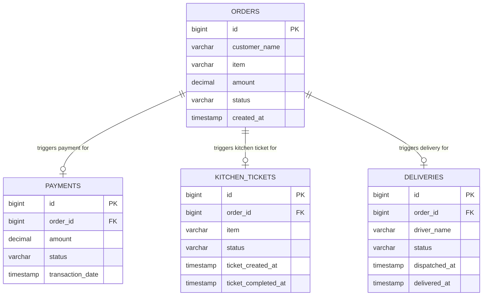

# Deliverable 2: Database Design

## Overview

Each microservice maintains its own isolated in-memory H2 database, following the **Database per Service** pattern. There is no shared database between services — each service owns its data.

---

## Database Configuration

| Service | Database Name | Port | Console URL |
|---------|--------------|------|-------------|
| Order Service | `orderdb` | 8080 | `http://localhost:8080/h2-console` |
| Payment Service | `paymentdb` | 8081 | `http://localhost:8081/h2-console` |
| Kitchen Service | `kitchendb` | 8082 | `http://localhost:8082/h2-console` |
| Delivery Service | `deliverydb` | 8083 | `http://localhost:8083/h2-console` |

**JDBC URL Pattern:** `jdbc:h2:mem:<dbname>;DB_CLOSE_DELAY=-1;DB_CLOSE_ON_EXIT=FALSE`
**Username:** `sa` | **Password:** *(empty)*

> Note: H2 in-memory databases are ephemeral — data resets on restart. For production, replace with MySQL/PostgreSQL.

---

## Table Definitions

### 1. `orders` table — Order Service

```sql
CREATE TABLE orders (
    id           BIGINT       NOT NULL AUTO_INCREMENT,
    customer_name VARCHAR(255) NOT NULL,
    item         VARCHAR(255) NOT NULL,
    amount       DECIMAL(10,2) NOT NULL,
    status       VARCHAR(50)  NOT NULL,
    created_at   TIMESTAMP,
    PRIMARY KEY (id)
);
```

| Column | Type | Constraints | Description |
|--------|------|-------------|-------------|
| `id` | `BIGINT` | PK, AUTO_INCREMENT | Unique order identifier |
| `customer_name` | `VARCHAR(255)` | NOT NULL | Name of the customer |
| `item` | `VARCHAR(255)` | NOT NULL | Food item ordered |
| `amount` | `DECIMAL(10,2)` | NOT NULL | Price in USD |
| `status` | `VARCHAR(50)` | NOT NULL | Current lifecycle status |
| `created_at` | `TIMESTAMP` | Auto-set on persist | Order creation time |

**Valid Status Values:** `PLACED`, `PAYMENT_PROCESSING`, `KITCHEN_PREP`, `OUT_FOR_DELIVERY`, `DELIVERED`, `CANCELLED`

---

### 2. `payments` table — Payment Service

```sql
CREATE TABLE payments (
    id               BIGINT        NOT NULL AUTO_INCREMENT,
    order_id         BIGINT        NOT NULL,
    amount           DECIMAL(10,2) NOT NULL,
    status           VARCHAR(50)   NOT NULL,
    transaction_date TIMESTAMP,
    PRIMARY KEY (id)
);
```

| Column | Type | Constraints | Description |
|--------|------|-------------|-------------|
| `id` | `BIGINT` | PK, AUTO_INCREMENT | Unique payment record ID |
| `order_id` | `BIGINT` | NOT NULL | Reference to Order (logical FK) |
| `amount` | `DECIMAL(10,2)` | NOT NULL | Amount processed |
| `status` | `VARCHAR(50)` | NOT NULL | `SUCCESS` or `FAILED` |
| `transaction_date` | `TIMESTAMP` | Auto-set on persist | Time of payment attempt |

> Note: `order_id` is a logical foreign key (no DB-level constraint since databases are separate services).

---

### 3. `kitchen_tickets` table — Kitchen Service

```sql
CREATE TABLE kitchen_tickets (
    id                   BIGINT       NOT NULL AUTO_INCREMENT,
    order_id             BIGINT       NOT NULL,
    item                 VARCHAR(255) NOT NULL,
    status               VARCHAR(50)  NOT NULL,
    ticket_created_at    TIMESTAMP,
    ticket_completed_at  TIMESTAMP,
    PRIMARY KEY (id)
);
```

| Column | Type | Constraints | Description |
|--------|------|-------------|-------------|
| `id` | `BIGINT` | PK, AUTO_INCREMENT | Unique kitchen ticket ID |
| `order_id` | `BIGINT` | NOT NULL | Reference to Order (logical FK) |
| `item` | `VARCHAR(255)` | NOT NULL | Food item to prepare |
| `status` | `VARCHAR(50)` | NOT NULL | `RECEIVED`, `PREPARING`, or `READY` |
| `ticket_created_at` | `TIMESTAMP` | Auto-set on persist | Ticket creation time |
| `ticket_completed_at` | `TIMESTAMP` | Set when READY | Food completion time |

---

### 4. `deliveries` table — Delivery Service

```sql
CREATE TABLE deliveries (
    id           BIGINT       NOT NULL AUTO_INCREMENT,
    order_id     BIGINT       NOT NULL,
    driver_name  VARCHAR(255),
    status       VARCHAR(50)  NOT NULL,
    dispatched_at TIMESTAMP,
    delivered_at  TIMESTAMP,
    PRIMARY KEY (id)
);
```

| Column | Type | Constraints | Description |
|--------|------|-------------|-------------|
| `id` | `BIGINT` | PK, AUTO_INCREMENT | Unique delivery record ID |
| `order_id` | `BIGINT` | NOT NULL | Reference to Order (logical FK) |
| `driver_name` | `VARCHAR(255)` | | Assigned driver name |
| `status` | `VARCHAR(50)` | NOT NULL | `ASSIGNED`, `IN_TRANSIT`, or `DELIVERED` |
| `dispatched_at` | `TIMESTAMP` | Auto-set on persist | Dispatch time |
| `delivered_at` | `TIMESTAMP` | Set when DELIVERED | Delivery completion time |

---

## ER Diagram (Logical — Across Services)



> The relationships above are **logical** (enforced by Camunda workflow), not physical database foreign keys, since each service has its own database.

---

## Data Flow Per Order Lifecycle Step

```
Customer Places Order
    ↓
orders.status = 'PLACED'
    ↓ (ActiveMQ triggers Camunda)
orders.status = 'PAYMENT_PROCESSING'
    ↓
payments row INSERTED (status = 'SUCCESS' or 'FAILED')
    ↓ (if SUCCESS)
orders.status = 'KITCHEN_PREP'
    ↓
kitchen_tickets row INSERTED (RECEIVED → PREPARING → READY)
    ↓
orders.status = 'OUT_FOR_DELIVERY'
    ↓
deliveries row INSERTED (ASSIGNED → IN_TRANSIT → DELIVERED)
    ↓
orders.status = 'DELIVERED'

    ↓ (if payment FAILED)
orders.status = 'CANCELLED'
```

---

## Notes on Production Migration

For production, replace H2 with MySQL/PostgreSQL:

```yaml
# application.yml (production profile)
spring:
  datasource:
    url: jdbc:mysql://<host>:3306/<dbname>
    username: ${DB_USERNAME}
    password: ${DB_PASSWORD}
    driver-class-name: com.mysql.cj.jdbc.Driver
  jpa:
    database-platform: org.hibernate.dialect.MySQL8Dialect
    hibernate:
      ddl-auto: validate  # Use Flyway or Liquibase for migrations
```
